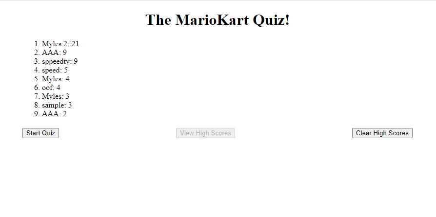

# Challenge 04 - Timed Quiz

## Description

This weeks challenge is to create a timed quiz. When users answer questions wrong, time is subtracted. At the end, a score is generated based on the time taken to complete the quiz and number of correct answers. Highscores are recorded and saved for comparison.

## Deployment

This website is live and can be played here:
[https://smithm4949.github.io/Timed-Quiz-Challenge-04/](https://smithm4949.github.io/Timed-Quiz-Challenge-04/)

## Example

Here is a sample of the high score screen (not showing questions so you can't cheat!)

## Authors and acknowledgment

This homework assignment was completed and developed by Myles Smith.

## Project status

This project is feature complete according to the acceptance criteria supplied but may continue to be developed. Future additions include better styling and more questions, as well as tweaks to balance the scoring.
